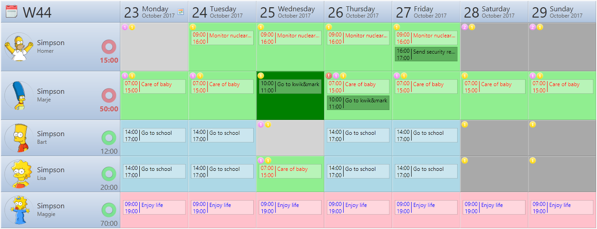
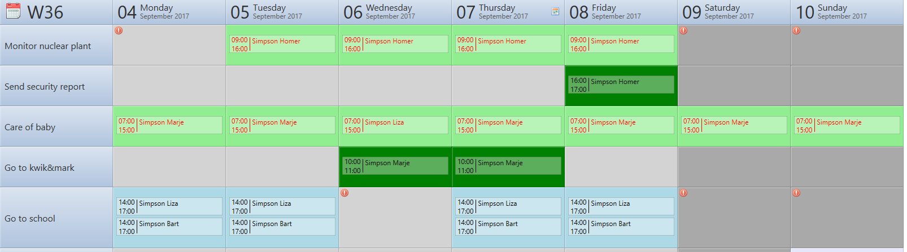
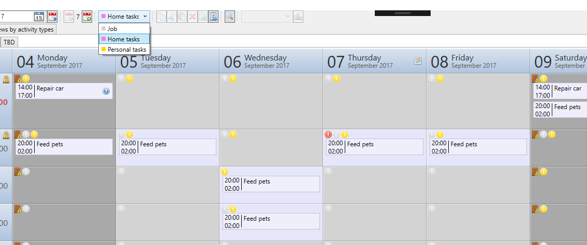
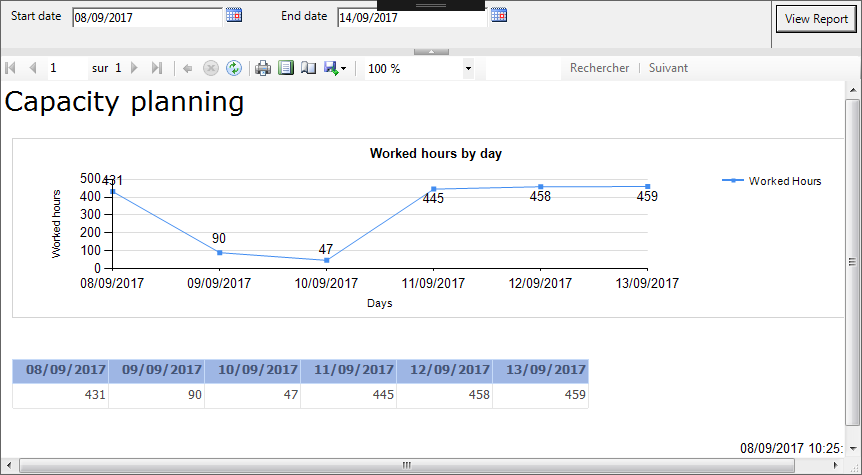

# About ePlanif
ePlanif is an open source tool for employees task planification. It can be used in small medium companies and large/world-wide companies.

# Features

|       Display activity by employee       |
| :--------------------------------------: |
|  |
| You can have an overall view of your teams using employees view, and take advantage of cell coloring to highlight important activities |

|         Display by activity type         |
| :--------------------------------------: |
|  |
| Sometimes it is important to check if all necessary ressources are affected to a particular activity |

|          User right management           |
| :--------------------------------------: |
|  |
| You can keep control on who can see or change planning using hierarchical groups management and windows authentication |

|             Layered display              |
| :--------------------------------------: |
|    |
| Keep your views clear using the layer system |

|             Reporting              |
| :--------------------------------------: |
|    |
| ePlanif integrates seamlessly with Microsoft Reporting Service in order to provide you beautifull reports |

**Learn more about other features into the wiki pages !**

# Credits

ePlanif uses some third party components. Those parts are discribed in details in wiki